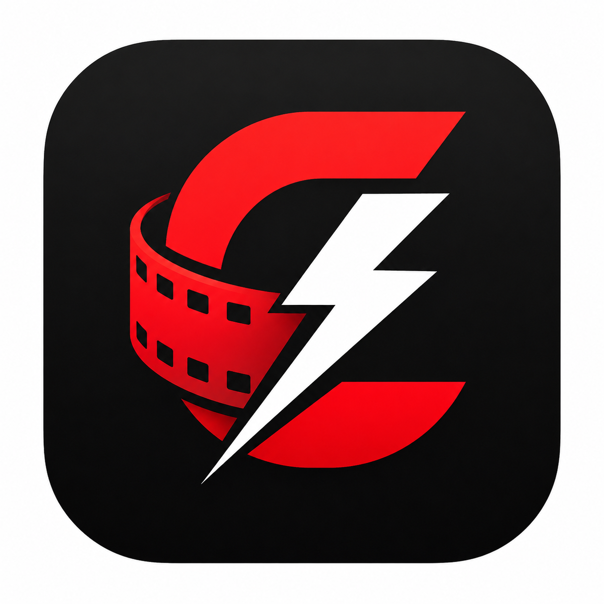
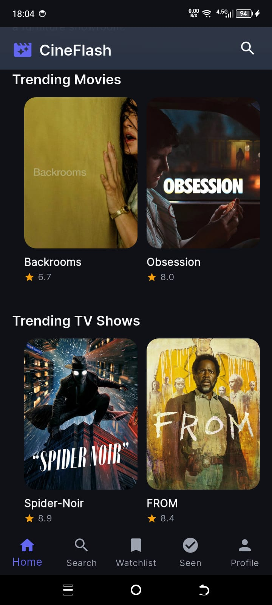
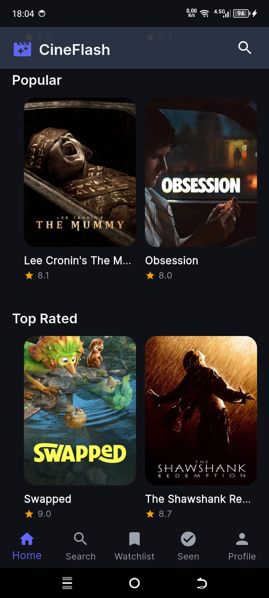
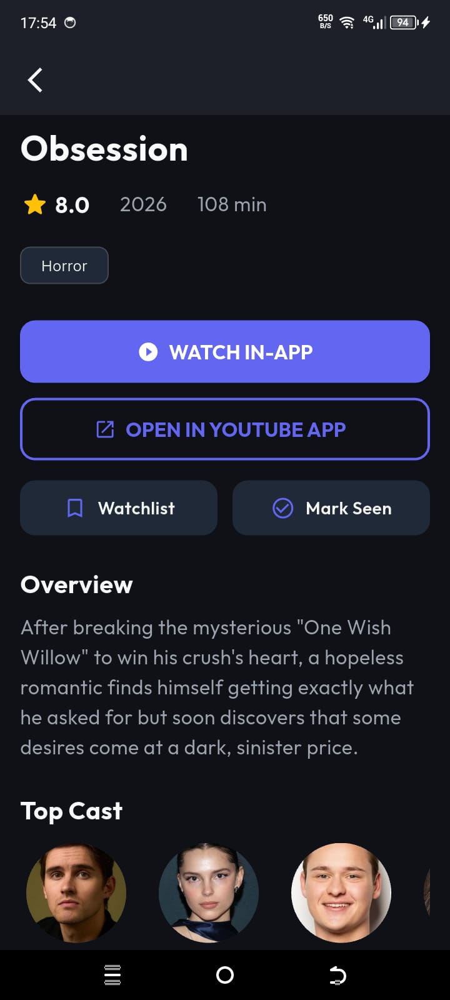
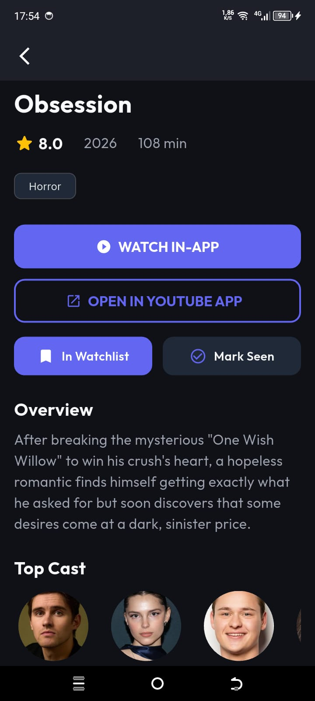
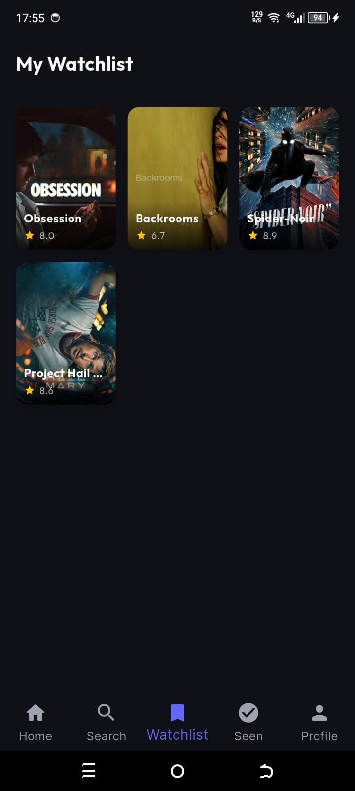

<p align="center">
  
</p>

# 🎬 CineFlash

> Votre application intelligente de suivi de films et séries

CineFlash est une application mobile cross-platform (Flutter) qui vous permet de découvrir, suivre et organiser vos films et séries préférés. Elle utilise TMDB pour les données, Supabase pour la synchronisation cloud, et Hugging Face pour les recommandations IA.

---

## ✨ Fonctionnalités

- **Découverte** — Films tendances, populaires et mieux notés
- **Recherche** — Recherche multi-critères (films, séries, acteurs)
- **Watchlist** — Ajoutez des films à voir plus tard
- **Déjà vu** — Marquez les films comme vus et notez-les
- **Détails complets** — Synopsis, casting, bande-annonce YouTube
- **Mode hors ligne** — Consultation de votre bibliothèque sans internet
- **Synchronisation cloud** — Sauvegarde sur Supabase (compte requis)
- **Recommandations IA** — Suggestions personnalisées via Hugging Face
- **Thème sombre** — Interface moderne avec Material You

---

## 🖼️ Captures d'écran

| Écran d'accueil | Trending Movies & TV |
|:-:|:-:|
|  |  |

| Popular & Top Rated | Recherche |
|:-:|:-:|
|  |  |

| Détails film | Bande-annonce & YouTube |
|:-:|:-:|
|  |  |

| Ajout Watchlist | Watchlist |
|:-:|:-:|
|  |  |

| Films vus |
|:-:|
|  |

---

## 🏗️ Architecture Technique

```
┌─────────────────────────────────────────────────────────┐
│                    CineFlash App                         │
├─────────────────────────────────────────────────────────┤
│  Flutter (Dart)                                        │
│  • Bloc/Cubit (State Management)                       │
│  • GoRouter (Navigation)                               │
│  • SQLite (Cache local / sqflite)                       │
├──────────────┬──────────────────────────┬───────────────┤
│  TMDB API     │  Supabase (Auth + Sync)  │  HuggingFace  │
│  (Données     │  (Compte utilisateur,    │  (IA :        │
│   films/séries)│   watchlist cloud)       │   sentiment,  │
│              │                          │   reco)       │
└──────────────┴──────────────────────────┴───────────────┘
```

### Flux de données

1. **TMDB API** → API Kotlin/Spring Boot sur Hugging Face Spaces → Flutter App
2. **Supabase Auth** → Authentification (email/mot de passe) + tables `watchlist_items` / `watched_items`
3. **SQLite locale** → Cache hors ligne des films populaires + watchlist locale
4. **Synchronisation** → Au login, les données locales non synchronisées sont poussées vers Supabase
5. **IA Hugging Face** → Analyse de sentiment des critiques + recommandations via modèles Transformer

---

## 🚀 Installation

### APK Android (recommandé)

Téléchargez le dernier APK depuis la section [Releases](https://github.com/StailiSaad/CINEFLASH/releases/latest).

[](https://github.com/StailiSaad/CINEFLASH/releases/download/v1.0.0/CineFlash-v1.0.0.apk)

```bash
# Installation via ADB
adb install CineFlash-v1.0.0.apk
```

### Build depuis les sources

```bash
git clone https://github.com/StailiSaad/CINEFLASH.git
cd CINEFLASH

# Installer les dépendances
flutter pub get

# Lancer en développement
flutter run

# Build release APK
flutter build apk --release
```

---

## 🔧 Configuration

### Variables d'environnement

| Variable | Description | Valeur par défaut |
|----------|-------------|-------------------|
| `TMDB_API_KEY` | Clé API TMDB | `e9c68f17bb0613ed4dc60ce2b3ac7e62` |
| `SUPABASE_URL` | URL du projet Supabase | `https://eomiilauphxypqlefejg.supabase.co` |
| `SUPABASE_ANON_KEY` | Clé anonyme Supabase | *(fournie dans le code)* |
| `HUGGINGFACE_URL` | URL du Space Hugging Face | `https://sdawgxxx-cineflash.hf.space` |

---

## 🧪 Technologies utilisées

### Frontend (Flutter)

| Package | Utilité |
|---------|---------|
| `flutter_bloc` | Gestion d'état |
| `go_router` | Navigation déclarative |
| `dio` | Requêtes HTTP |
| `sqflite` | Base de données locale |
| `supabase_flutter` | Authentification & sync cloud |
| `youtube_player_flutter` | Lecture des bandes-annonces |
| `google_fonts` | Typographie Inter & Outfit |
| `cached_network_image` | Cache des affiches |
| `shimmer` | Effets de chargement |
| `carousel_slider` | Carrousel des films tendances |

### Backend (Kotlin / Spring Boot)

| Technologie | Utilité |
|-------------|---------|
| Spring Boot 3 | API REST |
| Spring Security + JWT | Authentification |
| Spring Data JPA | ORM (PostgreSQL) |
| WebClient Reactive | Appels TMDB & Hugging Face |
| OpenAPI / Swagger | Documentation API |
| Hugging Face Inference API | Modèles NLP |

### Cloud

| Service | Utilité |
|---------|---------|
| **Supabase** | Authentification + base de données PostgreSQL |
| **Hugging Face Spaces** | Hébergement de l'API backend |
| **TMDB** | Données films et séries |

---

## 📁 Structure du projet

```
CINEFLASH/
├── cinevault_project/
│   ├── cinevault_mobile/        # Application Flutter
│   │   └── lib/
│   │       ├── main.dart
│   │       ├── src/
│   │       │   ├── core/        # Thème, routeur, constantes, DI
│   │       │   │   ├── constants/
│   │       │   │   ├── di/
│   │       │   │   ├── router/
│   │       │   │   ├── theme/
│   │       │   │   └── utils/
│   │       │   ├── data/        # Datasources, repositories, models
│   │       │   │   ├── database/
│   │       │   │   ├── datasources/
│   │       │   │   ├── models/
│   │       │   │   └── repositories/
│   │       │   └── presentation/ # UI & BLoC
│   │       │       ├── blocs/
│   │       │       │   ├── app/
│   │       │       │   ├── movie_details/
│   │       │       │   ├── movies/
│   │       │       │   └── search/
│   │       │       └── screens/
│   │       │           ├── auth/
│   │       │           ├── details/
│   │       │           ├── home/
│   │       │           ├── profile/
│   │       │           ├── search/
│   │       │           ├── watched/
│   │       │           └── watchlist/
│   │       │       └── widgets/
│   │       └── assets/
│   │           ├── images/
│   │           └── icons/
│   └── cinevault_api/           # API Kotlin/Spring Boot
│       └── src/main/kotlin/com/cineflash/
│           ├── config/
│           ├── controller/
│           ├── dto/
│           ├── entity/
│           ├── exception/
│           ├── repository/
│           ├── security/
│           └── service/
├── pic/                         # Ressources icônes
├── screenshots/                 # Captures d'écran pour le README
└── README.md
```

---

## 🔑 API Endpoints

### Auth
| Méthode | Endpoint | Description |
|---------|----------|-------------|
| `POST` | `/api/v1/auth/login` | Connexion / Création de compte |
| `GET` | `/api/v1/auth/me` | Profil utilisateur |

### Movies / TV
| Méthode | Endpoint | Description |
|---------|----------|-------------|
| `GET` | `/api/v1/movies/trending` | Films tendances |
| `GET` | `/api/v1/movies/popular` | Films populaires |
| `GET` | `/api/v1/movies/top-rated` | Mieux notés |
| `GET` | `/api/v1/movies/{id}` | Détails d'un film |
| `GET` | `/api/v1/movies/search` | Recherche films |
| `GET` | `/api/v1/tv/trending` | Séries tendances |
| `GET` | `/api/v1/tv/popular` | Séries populaires |

### Watchlist / Watched
| Méthode | Endpoint | Description |
|---------|----------|-------------|
| `GET` | `/api/v1/watchlist` | Liste de suivi |
| `POST` | `/api/v1/watchlist` | Ajouter à la watchlist |
| `DELETE` | `/api/v1/watchlist/{tmdbId}/{mediaType}` | Retirer |
| `GET` | `/api/v1/watched` | Films vus |
| `POST` | `/api/v1/watched` | Marquer comme vu |

### IA (Hugging Face)
| Méthode | Endpoint | Description |
|---------|----------|-------------|
| `POST` | `/api/v1/ai/sentiment` | Analyse de sentiment |
| `POST` | `/api/v1/ai/recommendations` | Recommandations |

---

## 📱 Compatibilité

- **Android** : API 21+ (Android 5.0+)
- **iOS** : iOS 13+ *(nécessite build Xcode)*
- **Web** : *(en cours)*

---

## 📄 Licence

Distribué sous licence MIT. Voir le fichier `LICENSE` pour plus d'informations.

---

## 👤 Auteur

**Saad Staili** 

- 📧 Email : saadstaili1903@gmail.com
- 💼 LinkedIn : [Saad Staili](https://linkedin.com/in/saad-staili)
- 🐙 GitHub : [@StailiSaad](https://github.com/StailiSaad)

---

*Projet développé avec Flutter et ❤️*
